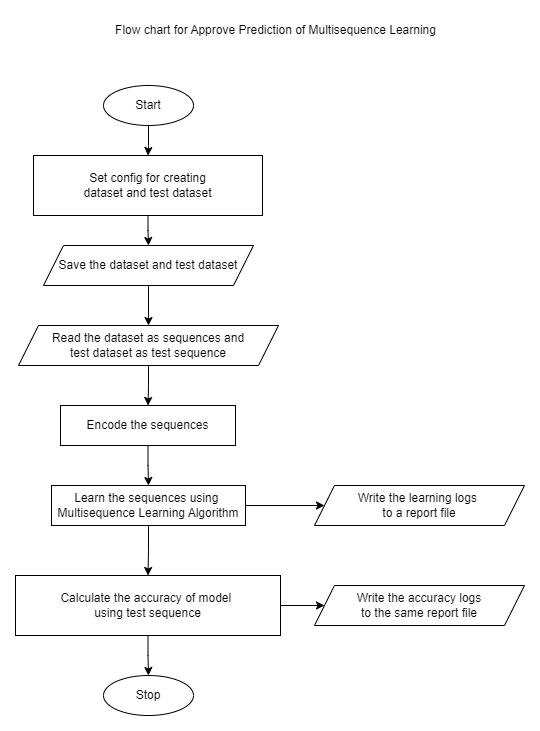
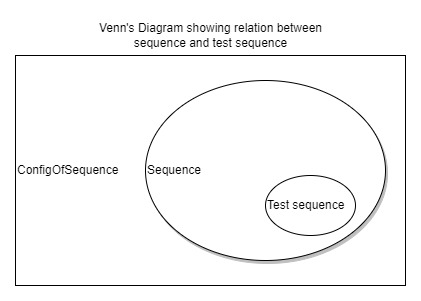
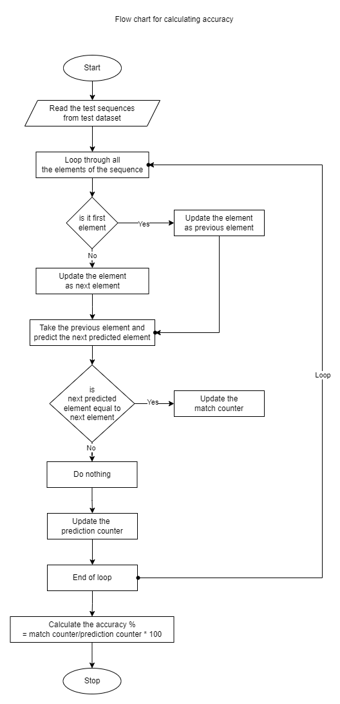
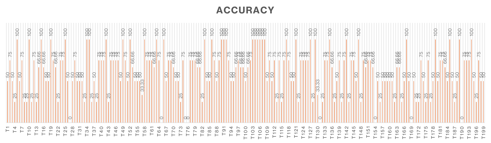

# ML22/23-15   Approve Prediction of Multisequence Learning 

## Introduction

This experiment to understand how multisequence learning algorithm learns sequences and prediction works, implement new mothods to read and learn data from file and then test the samples with sample subsequences to calculate the prediction accuracy.

## Implementation



Fig: Overview of the project

`Sequence` is our main data model of the sequences which are learned by the multisequence learning algorithm.

```csharp
// Model of sequence
public class Sequence
{
    // name of sequence
    public String name { get; set; }
    // sequence itself
    public int[] data { get; set; }
}
```

eg: 

- Dataset:

```json
[
  {
    "name": "S1",
    "data": [ 4, 5, 6, 8, 9, 10, 11, 12, 13, 14, 15, 16, 17, 18, 19, 20, 21, 23, 24, 25, 27, 30, 32, 33, 34 ]
  },
  {
    "name": "S2",
    "data": [ 4, 5, 6, 7, 8, 9, 10, 11, 12, 13, 14, 15, 16, 18, 19, 20, 21, 24, 25, 27, 30, 31, 32, 33, 34 ]
  },
  {
    "name": "S3",
    "data": [ 5, 6, 7, 8, 9, 10, 11, 12, 13, 14, 17, 18, 19, 21, 22, 23, 24, 25, 26, 27, 28, 30, 31, 33, 34 ]
  }
]
```

- Test Dataset:

```json
[
  {
    "name": "T1",
    "data": [ 24, 25, 27, 28, 29 ]
  },
  {
    "name": "T2",
    "data": [ 13, 15, 16, 17, 18 ]
  },
  {
    "name": "T3",
    "data": [ 19, 21, 22, 23, 24 ]
  },
  {
    "name": "T4",
    "data": [ 17, 18, 19, 20, 21 ]
  }
]
```

`ConfigOfSequence` is another data model used as configuration for creating the data in `Sequence`. 

```csharp
// Model of configuration used to create sequence
public class ConfigOfSequence
{
    // count of the sequence
    public int count { get; set; }
    // length/size of each sequence
    public int size { get; set; }
    // length/size of each test sequence
    public int testSize { get; set; }
    // start value of sequence
    public int startVal { get; set; }
    // end value of sequence
    public int endVal { get; set; }

    // constructor
    public ConfigOfSequence(int Count, int Size, 
        int TestSize, int StartVal, int EndVal)
    {
        this.count = Count;
        this.size = Size + 3;
        this.testSize = TestSize;
        this.startVal = StartVal;
        this.endVal = EndVal;
    }
}
```

Our project is mainly divided into 3 helper methods:

1. [MultisequenceHelper.cs](../MultisequenceHelper.cs) - functions used commonly and related to algorithm are in this file.

- GetEncoder() is used to get the encoder setting, as per `inputBits` and `max` which is maximum value to be encoded. We are using `ScalarEncoder` since we are encoding numeric values.

```csharp
/// <summary>
/// Get the encoder with settings
/// </summary>
/// <param name="inputBits">input bits</param>
/// <param name="max">max value of input</param>
/// <returns>Object of EncoderBase</returns>
public static ScalarEncoder GetEncoder(int inputBits, int max)
{
    Dictionary<string, object> settings = new Dictionary<string, object>()
    {
        { "W", 15},
        { "N", inputBits},
        { "Radius", -1.0},
        { "MinVal", 0.0},
        { "Periodic", false},
        { "Name", "scalar"},
        { "ClipInput", false},
        { "MaxVal", (double)max}
    };

    ScalarEncoder encoder = new ScalarEncoder(settings);

    return encoder;
}
```

- GetHtmConfig() is used to get the HTM configuration needed to create the `Connections` as Human Brain's Neocortex.

```csharp
/// <summary>
/// HTM Config for creating Connections
/// </summary>
/// <param name="inputBits">input bits</param>
/// <param name="numColumns">number of columns</param>
/// <returns>Object of HTMConfig</returns>
public static HtmConfig GetHtmConfig(int inputBits, int numColumns)
{
    HtmConfig cfg = new HtmConfig(new int[] { inputBits }, new int[] { numColumns })
    {
        Random = new ThreadSafeRandom(42),

        CellsPerColumn = 25,
        GlobalInhibition = true,
        LocalAreaDensity = -1,
        NumActiveColumnsPerInhArea = 0.02 * numColumns,
        PotentialRadius = (int)(0.15 * inputBits),
        //InhibitionRadius = 15,

        MaxBoost = 10.0,
        DutyCyclePeriod = 25,
        MinPctOverlapDutyCycles = 0.75,
        MaxSynapsesPerSegment = (int)(0.02 * numColumns),

        ActivationThreshold = 15,
        ConnectedPermanence = 0.5,

        // Learning is slower than forgetting in this case.
        PermanenceDecrement = 0.25,
        PermanenceIncrement = 0.15,

        // Used by punishing of segments.
        PredictedSegmentDecrement = 0.1
    };

    return cfg;
}
```

- ReadDataset() is used to read the dataset file when given full path of the file.

```csharp
/// <summary>
/// Reads dataset from the file
/// </summary>
/// <param name="path">full path of the file</param>
/// <returns>Object of list of Sequence</returns>
public static List<Sequence> ReadDataset(string path)
{
    Console.WriteLine("Reading Sequence...");
    String lines = File.ReadAllText(path);
    List<Sequence> sequence = System.Text.Json.JsonSerializer.Deserialize<List<Sequence>>(lines);

    return sequence;
}
```

- SaveDataset() is used to save the list of sequence when given name of file.

```csharp
/// <summary>
/// Saves the dataset in 'dataset' folder in BasePath of application
/// </summary>
/// <param name="sequences">Object of list of Sequence</param>
/// <returns>Full path of the dataset</returns>
public static string SaveDataset(List<Sequence> sequences, string filename)
{
    if (sequences == null)
        return null;

    string BasePath = AppDomain.CurrentDomain.BaseDirectory;
    string datasetFolder = Path.Combine(BasePath, "dataset");
    if (!Directory.Exists(datasetFolder))
        Directory.CreateDirectory(datasetFolder);
    string datasetPath = Path.Combine(datasetFolder, $"{filename}_{DateTime.Now.Ticks}.json");

    Console.WriteLine("Saving dataset...");

    if (!File.Exists(datasetPath))
    {
        using (StreamWriter sw = File.CreateText(datasetPath))
        {
            sw.WriteLine(JsonConvert.SerializeObject(sequences));
        }
    }

    return datasetPath;
}
```

- GetLogFile() creates a unique file name and file used to save logs.

```csharp
/// <summary>
/// Create a unique file name for writing logs
/// </summary>
/// <returns>returns name of log file</returns>
public static string GetLogFile()
{
    string BasePath = AppDomain.CurrentDomain.BaseDirectory;
    string reportFolder = Path.Combine(BasePath, "report");
    if (!Directory.Exists(reportFolder))
        Directory.CreateDirectory(reportFolder);
    
    var ticks = DateTime.Now.Ticks;
    string reportPath = Path.Combine(reportFolder, $"reports_{ticks}.txt");

    if (!File.Exists(reportPath))
    {
        using (StreamWriter sw = File.CreateText(reportPath))
        {
            sw.WriteLine($"Log file created at {ticks}...");
        }
    }

    return reportPath;
}
```

- WriteLogs() is used to write logs when given a file name.

```csharp
/// <summary>
/// Write logs in the given file name with full path
/// </summary>
/// <param name="filePath">full path of log</param>
/// <param name="logs">logs to be written</param>
public static void WriteLogs(string filePath, List<string> logs)
{
File.AppendAllLines(filePath, logs);
}
```

2. [DatasetHelper.cs](../DatasetHelper.cs) -  functions specific to dataset are here.

- IsCreateDatasetValid() is used to checks if the parameters for creating dataset is valid or not.

```csharp
/// <summary>
/// Checks if the parameters for creating dataset is valid or not
/// </summary>
/// <param name="numberOfSequence">number of sequence which needs to be created</param>
/// <param name="size">size of sequence</param>
/// <param name="startVal">start value of sequence</param>
/// <param name="endVal">end value of sequence</param>
/// <returns>return true if parameters are valid</returns>
public static bool IsCreateDatasetValid(int numberOfSequence, int size, int startVal, int endVal)
{
    try
    {
        if (numberOfSequence < 2)
            throw new ArgumentException("Number sequence must atleast 2");

        //need atleast size as 9 since we randomly remove 3 elements and output size will be 6
        if (size <= 9)
            throw new ArgumentException("Size of each sequence must be atleast 8");

        //the set of number in sequence must be a natural number i.e all positive numbers
        if (startVal < 0)
            throw new ArgumentException("startVal must be postive to create positive sequences");

        //endValue of sequence must be greater than startValue to have a sequence
        if (endVal < startVal)
            throw new ArgumentException("endVal must be greater than startVal");

        //since minimum size of sequence is 8 the difference in startValue and endValue must be atleast 9
        if ((endVal - startVal) < size)
            throw new ArgumentException("Size is greater than unique number of input");
    }
    catch (Exception ex)
    {
        Console.WriteLine($"Exception - IsCreateDatasetValid: {ex.Message}");
        return false;
    }


    return true;
}
```

- CreateDataset() is used to create list of Sequence as per configuration.

```csharp
/// <summary>
/// Creates list of Sequence as per configuration
/// </summary>
/// <param name="numberOfSequence"></param>
/// <param name="size"></param>
/// <param name="startVal"></param>
/// <param name="endVal"></param>
/// <returns>return a list of sequence</returns>
public static List<Sequence> CreateDataset(int numberOfSequence, int size, int startVal, int endVal)
{
    // validate config before creating dataset
    if (!IsCreateDatasetValid(numberOfSequence, size, startVal, endVal))
        return null;
    Console.WriteLine("Creating Sequence...");
    // create the sequence
    List<Sequence> sequence = CreateSequences(numberOfSequence, size, startVal, endVal);

    return sequence;

}
```

- CreateSequences() is used to create multiple sequences as per parameters.

```csharp
/// <summary>
/// Creates multiple sequences as per parameters
/// </summary>
/// <param name="count">Number of sequences to be created</param>
/// <param name="size">Size of each sequence</param>
/// <param name="startVal">Minimum value of item in a sequence</param>
/// <param name="stopVal">Maximum value of item in a sequence</param>
/// <returns>Object of list of Sequence</returns>
public static List<Sequence> CreateSequences(int count, int size, int startVal, int stopVal)
{
    List<Sequence> dataset = new List<Sequence>();

    // loop thru the count as number of sequences tobe created
    for (int i = 0; i < count; i++)
    {
        Sequence sequence = new Sequence();
        sequence.name = $"S{i + 1}";
        sequence.data = getSyntheticData(size, startVal, stopVal);
        dataset.Add(sequence);
    }

    return dataset;
}
```

- getSyntheticData() is used to create a sequence of given size-3 and range.

```csharp
/// <summary>
/// Creates a sequence of given size-3 and range
/// </summary>
/// <param name="size">Size of list</param>
/// <param name="startVal">Min range of the list</param>
/// <param name="stopVal">Max range of the list</param>
/// <returns></returns>
private static int[] getSyntheticData(int size, int startVal, int stopVal)
{
    int[] data = new int[size];

    // create the sorted random sequence and randomly remove 3 ele,emts from sequences
    data = randomRemoveInt(randomInt(size, startVal, stopVal), 3);

    return data;
}
```

3. [TestdatasetHelper.cs](../TestdatasetHelper.cs) -  functions specific to test dataset are here.

- CreateTestDataset() is used to generate a customizable test dataset for sequence-based evaluation.

```csharp
/// <summary>
/// Generates a customizable test dataset for sequence-based evaluation
/// </summary>
/// <param name="numberOfSequence">number of sequence which needs to be created</param>
/// <param name="size">size of sequence</param>
/// <param name="testSize">size of test sequence</param>
/// <param name="startVal">start value of sequence</param>
/// <param name="endVal">end value of sequence</param>
/// <param name="sequences">Name of the sequence</param>
/// <returns>return the test sequences generated</returns>
public static List<Sequence> CreateTestDataset(int numberOfSequence, int size, int testSize, int startVal, int endVal, List<Sequence> sequences)
{
    if (!IsCreateTestDatasetValid(numberOfSequence, size, testSize, startVal, endVal))
        return null;

    List<Sequence> testSequences = new List<Sequence>();

    for(int i = 0; i < numberOfSequence; i++)
    {
        // select random sequence
        Sequence sequence = SelectRandomSequence(sequences);
        // create sub-sequence
        Sequence testSequence = CreateTestSequence(testSize, size, sequence, $"T{i+1}");
        testSequences.Add(testSequence);
    }

    return testSequences;
}
```

- SelectRandomSequence() is used to generate a customizable test dataset for sequence-based evaluation.

```csharp
/// <summary>
/// Generates a customizable test dataset for sequence-based evaluation
/// </summary>
/// <param name="sequences">sequences which needs to be selected</param>
/// <returns>return the selected sequence</returns>
private static Sequence SelectRandomSequence(List<Sequence> sequences)
{
    Random random = new Random(Guid.NewGuid().GetHashCode());
    Sequence[] sequence = sequences.ToArray();
    int selectSequenceNo = random.Next(0,sequence.Length);
    Sequence selectSequence = sequence[selectSequenceNo];
    
    return selectSequence;
}
```

- CreateTestSequence() is used to create a new subsequence from the test sequence.



```csharp
/// <summary>
/// Creates a new subsequence from the test sequence
/// </summary>
/// <param name="testSize">size of test sequence</param>
/// <param name="size">size of sequence</param>
/// <param name="sequence">original sequence from which the subsequence is created</param>
/// <param name="sequenceName">Name of the new subsequence</param>
/// <returns>return new Subsequence created</returns>
private static Sequence CreateTestSequence(int testSize, int size, Sequence sequence, string sequenceName)
{
    Sequence newSubSequence = new Sequence();
    newSubSequence.name = sequenceName;
    Random random = new Random(Guid.NewGuid().GetHashCode());
    int selectIndexNo = random.Next(0, size-testSize-1); // is that the array index doesnot go out of bound later
    int[] value = new int[testSize];

    // copy sub-sequence in temp array
    for (int i = testSize, j = 0; i > 0; i--, j++)
    {
        value[j] = sequence.data[selectIndexNo+j];
    }
    newSubSequence.data = value;

    return newSubSequence;
}
```

- IsCreateTestDatasetValid() is used to check if the parameters for creating dataset is valid or not.

```csharp
/// <summary>
/// Checks if the parameters for creating dataset is valid or not
/// </summary>
/// <param name="numberOfSequence">Number of sequences which needs to be generated</param>
/// <param name="size">size of sequence</param>
/// <param name="testSize">size of test sequence</param>
/// <param name="startVal">>start value of sequence</param>
/// <param name="endVal">end value of sequence</param>
/// <returns>return true if parameters are valid</returns>
private static bool IsCreateTestDatasetValid(int numberOfSequence, int size, int testSize, int startVal, int endVal)
{
    try
    {
        // we need at least 1 test case to test
        if (numberOfSequence < 1)
            throw new ArgumentException("You must create atleast 1 test sequence");

        // need atleast size as 3 
        if (testSize <= 2)
            throw new ArgumentException("Size of each sequence must be atleast 3 to create a piece of sequence");

        // test sequence must be smaller than the actual sequence
        if(size-testSize < 0)
            throw new ArgumentException("Size of test sequence must smaller the actual size of sequence");

    }
    catch (Exception ex)
    {
        Console.WriteLine($"Exception - IsCreateTestDatasetValid: {ex.Message}");
        return false;
    }


    return true;
}
```

4. [Program.cs](../Program.cs) -  all the functions are called here and wrapped with specific parameters.

- CreateSaveData() is a wrapper function used to create and save dataset and test dataset as per config.

```csharp
/// <summary>
/// Creates and saves dataset and test dataset as per config
/// </summary>
/// <returns>list of dataset full path</returns>
private static List<string> CreateSaveData()
{
    var datasetPath = new List<string>();
    int numberOfSequence = 50;
    int numberOfTestSequence = 10;
    int size = 25;
    int testSize = 5;
    int startVal = 4;
    int endVal = 35;

    max = endVal;

    // creating config for dataset
    ConfigOfSequence configOfSequence = new ConfigOfSequence(numberOfSequence, size, 0, startVal, endVal);

    var dataset = CreateDataset(configOfSequence);
    datasetPath.Add(dataset);

    // creating config for test dataset
    ConfigOfSequence configOfTestSequence = new ConfigOfSequence(numberOfTestSequence, size, testSize, startVal, endVal);

    var testDataset = CreateTestDataset(configOfTestSequence, MulitsequenceHelper.ReadDataset(dataset));
    datasetPath.Add(testDataset);
    return datasetPath;
}
```

- PredictNextElement() is a function that predicts the next element and 



```csharp
/// <summary>
/// Predicts the next element in the sequence using the provided predictor and input list and calculates accuracy
/// </summary>
/// <param name="predictor">predictor used for making predictions</param>
/// <param name="list">input list for prediction</param>
private static double PredictNextElement(Predictor predictor, int[] list)
{
    int matchCount = 0;
    int predictions = 0;
    double accuracy = 0.0;
    int prev = -1;
    bool first = true;

    Debug.WriteLine("------------------------------");

    // loop through all the items in the list
    foreach (var item in list)
    {
        
        /*
         * for the first item do not predict 
         */
        if(first)
        {
            first = false;
        }
        else 
        {
            // predict the next element of previously saved element
            Console.WriteLine($"Input: {prev}");
            var res = predictor.Predict(prev);

            if (res.Count > 0)
            {
                foreach (var pred in res)
                {
                    Debug.WriteLine($"{pred.PredictedInput} - {pred.Similarity}");
                }

                var tokens = res.First().PredictedInput.Split('_');
                var tokens2 = res.First().PredictedInput.Split('-');
                Debug.WriteLine($"Predicted Sequence: {tokens[0]}, predicted next element {tokens2.Last()}");

                // compare the predicted element with actual next element in sequence
                if (item == Int32.Parse(tokens2.Last()))
                {
                    // increment the count since matched
                    matchCount++;
                }

                // increment the count since predict function was called and prediction took place
                predictions++;
            }
            else
                Debug.WriteLine("Nothing predicted :(");
        }

        // save the element as previous to compare with next element predicted
        prev = item;
    }

    /*
     * ACCURACY calculated here!!!!!!
     * 
     * Accuracy is calculated as number of matching predictions made 
     * divided by total number of prediction made for an element in subsequence
     * 
     * accuracy = number of matching predictions/total number of prediction * 100
     */
    accuracy = (double)matchCount / predictions * 100;
    Debug.WriteLine("------------------------------");

    return accuracy;
}
```
## How to run the project

1. Open the [NeoCortexApi.sln](../../../NeoCortexApi.sln) and select `MultiSequenceLearning` as startup project.

2. In [Program.cs](../Program.cs), we have `CreateSaveData()` you can configure the values as per your choice and run the experiment.

3. Look for dataset, test dataset and report file generated in `bin` folder which is not commited in github.

    eg: sample [dataset](../dataset/dataset_638432510189466635.json), [test dataset](../dataset/dataset_test_638432510191243020.json), and [report](../reports/reports_638432510192137895.txt).

## Results

The experiment was ran around 20 times which learned over 1000 different sequences in total of size 25 each and tested with 200 total sub-sequence. Each run has different dataset and test dataset which can be found [here](../dataset) and full report of runs are [here](../reports).

Average time for each run of experiment was around 3.5-4hr. Counting some stats from below plot as 8 runs has 0% accuracy, 36 runs have 100% accuracy which we expect, 58 runs have 75% accuracy.



Theoretically the accuracy of all the runs should 100% since we see that learing was done with 100% accuracy for 30 consecutive time before moving to next statement. But we see some runs with 0% accuracy which can be deduced as our model is not overfitted.  

## Reference

- Forked from [ddobric/neocortexapi](https://github.com/ddobric/neocortexapi)

- [Numenta Research Publication](https://www.numenta.com/resources/research-publications/) 

- [Machine Learning Guide to HTM](https://www.numenta.com/blog/2019/10/24/machine-learning-guide-to-htm/)